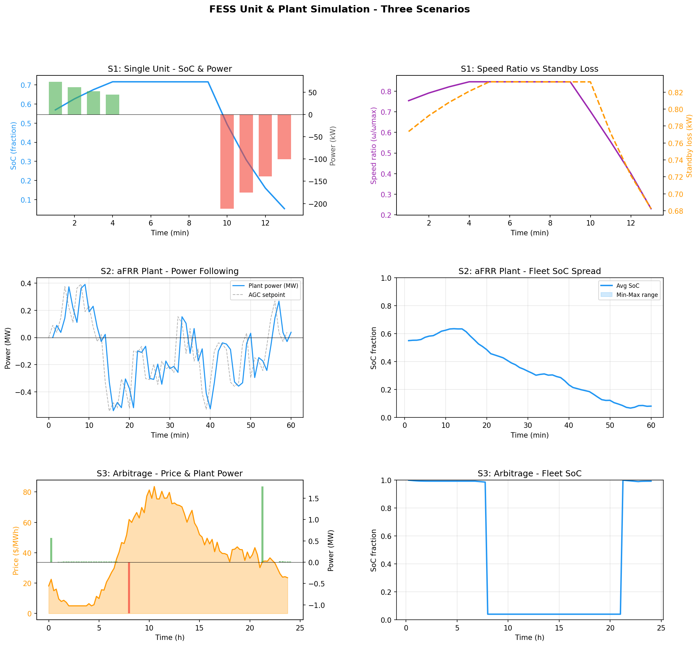

# FESS Modelling and Monetization

A production-grade Python framework for **flywheel battery modelling and energy trading**. It covers the full stack: high-fidelity physics simulation → LP/MILP day-ahead arbitrage optimisation → revenue stacking across multiple ancillary service markets.

> Originally developed as part of research at [DTU Electro](https://gitlab.gbar.dtu.dk/project/flywheel_model). Ported and extended here for open portfolio use.

---

## Contents

- [What is a Flywheel Energy Storage System?](#what-is-a-flywheel-energy-storage-system)
- [Why Model and Monetize FESS?](#why-model-and-monetize-fess)
- [Architecture](#architecture)
- [Installation](#installation)
- [Module Reference](#module-reference)
- [Optimisation Examples](#optimisation-examples)
  - [Example 1 — Basic Physics Simulation](#example-1--basic-physics-simulation)
  - [Example 2 — Fleet aFRR Regulation](#example-2--fleet-afrr-regulation)
  - [Example 3 — LP Day-Ahead Arbitrage](#example-3--lp-day-ahead-arbitrage)
  - [Example 4 — MILP with 2D Piecewise-Linear Efficiency](#example-4--milp-with-2d-piecewise-linear-efficiency)
- [Simulation Results](#simulation-results)
- [Physics Background](#physics-background)
- [Licence](#licence)

---

## What is a Flywheel Energy Storage System?

A Flywheel Energy Storage System (FESS) stores energy as **rotational kinetic energy** in a high-speed rotor suspended in a near-vacuum enclosure. When the grid needs power, the rotor drives a motor/generator to discharge. When surplus power is available, the motor accelerates the rotor to charge.

Key physical properties that distinguish FESS from chemical batteries:

| Property | FESS | Li-ion |
|---|---|---|
| Cycle life | Unlimited (no degradation) | ~3 000–6 000 cycles |
| Round-trip efficiency | 85–95% | 90–95% |
| Power density | ~10× higher | Baseline |
| Energy density | ~10× lower | Baseline |
| Self-discharge | Moderate (standby losses) | Low |
| Response time | < 1 ms | ~100 ms |
| Optimal duration | Seconds to minutes | Minutes to hours |

FESS excels at **high-cycle, short-duration** grid services — frequency regulation (FCR, aFRR), synthetic inertia, and fast arbitrage — where Li-ion would degrade rapidly.

---

## Why Model and Monetize FESS?

Grid-connected FESS units must bid into competitive energy and ancillary service markets. Profitability depends on:

1. **Accurate physics** — efficiency is not constant; it varies with shaft speed (SoC) and power level. Standby losses are speed-dependent and non-trivial.
2. **Optimal dispatch** — a day-ahead price-taker must solve a constrained energy scheduling problem. Using a flat efficiency constant underestimates round-trip losses and overestimates revenue.
3. **Revenue stacking** — combining day-ahead arbitrage with FCR/aFRR availability payments significantly improves project economics.

This framework provides all three layers: a physics engine, an LP lineariser, and a MILP solver that captures the 2-D efficiency surface (Power × SoC).

---

## Architecture

```
┌──────────────────────────────────────────────────────────────────┐
│                      Optimisation Tier                           │
│                                                                  │
│  lp_day_ahead_example.py      lp_piecewise_example.py           │
│  (scipy LP / linprog)         (scipy MILP / HiGHS)              │
│        │                              │                          │
│  linearized_physics.py        piecewise_linearization.py        │
│  (scalar LP constants)        (2-D Power×SoC grid, MILP)        │
└──────────────────────┬───────────────────────┬───────────────────┘
                       │                       │
┌──────────────────────▼───────────────────────▼───────────────────┐
│                       Simulation Tier                            │
│                                                                  │
│  fess_plant.py   ──────────────────────────────────────────────  │
│  (fleet aggregation, dispatch strategy, revenue stacking)        │
│        │                                                         │
│  fess_unit.py          efficiency_models.py   standby_losses.py  │
│  (single-unit physics) (machine + inverter)   (decomposed losses)│
└──────────────────────────────────────────────────────────────────┘
```

---

## Installation

```bash
git clone https://github.com/stephen211111/fess-modelling-and-monetization.git
cd fess-modelling-and-monetization
pip install -r requirements.txt
```

**Python ≥ 3.9** is required. All solvers run through `scipy` — no external LP/MILP solver licence is needed.

```
numpy>=1.24
scipy>=1.9          # HiGHS MILP backend (integrality parameter)
pandas>=1.5
matplotlib>=3.6
```

---

## Module Reference

| Module | Purpose |
|---|---|
| `fess_unit.py` | Single-unit state machine: kinetic energy, SoC–speed coupling, ramp limits |
| `efficiency_models.py` | Decomposed machine (copper/iron/windage) + SiC inverter (switching/conduction) losses |
| `standby_losses.py` | Speed-dependent standby: aerodynamic drag, AMB eddy currents, cooling, vacuum pump |
| `fess_plant.py` | Fleet aggregation, dispatch strategies (SOC-balanced, droop, priority), revenue stacking |
| `linearized_physics.py` | Collapses nonlinear physics into LP-ready scalar constants (η_c, η_d, standby kW) |
| `piecewise_linearization.py` | 2-D Power×SoC grid for MILP, with bilinearity resolved via auxiliary variables |
| `example_usage.py` | Three worked demos: charge/discharge cycle, aFRR regulation, threshold arbitrage |
| `lp_day_ahead_example.py` | Full LP day-ahead optimisation with price-taker formulation |
| `lp_piecewise_example.py` | MILP equivalent capturing efficiency-surface variation |

---

## Optimisation Examples

### Example 1 — Basic Physics Simulation

Simulate a single 250 kW / 16.67 kWh unit through a charge–idle–discharge cycle.

```python
from fess_unit import FESSUnit, FESSParams

params = FESSParams(
    rated_power_kw=250.0,
    rated_energy_kwh=16.67,
    min_speed_ratio=0.20,   # SoC cannot drop below 4 % (speed ratio²)
    max_ramp_kw_per_s=500.0
)

unit = FESSUnit(params)
unit.set_soc(0.5)           # start at 50 % SoC

dt = 60.0  # 1-minute timesteps
snapshots = []

# Charge for 4 minutes at rated power
for _ in range(4):
    snap = unit.step(power_command_kw=250.0, dt_s=dt)
    snapshots.append(snap)

# Idle for 5 minutes (standby losses drain SoC)
for _ in range(5):
    snap = unit.step(power_command_kw=0.0, dt_s=dt)
    snapshots.append(snap)

# Discharge for 4 minutes at rated power
for _ in range(4):
    snap = unit.step(power_command_kw=-250.0, dt_s=dt)
    snapshots.append(snap)

for s in snapshots:
    print(f"t={s.elapsed_s/60:.0f} min | SoC={s.soc_frac*100:.1f}% "
          f"| P_actual={s.power_actual_kw:+.1f} kW | η={s.efficiency:.3f}")
```

**Expected output (truncated):**
```
t=1 min | SoC=52.4% | P_actual=+250.0 kW | η=0.951
t=2 min | SoC=54.7% | P_actual=+250.0 kW | η=0.952
...
t=5 min | SoC=54.5% | P_actual=+0.0 kW   | η=nan    ← standby drain visible
...
t=10 min| SoC=52.1% | P_actual=-248.3 kW | η=0.949  ← power derated near min SoC
```

---

### Example 2 — Fleet aFRR Regulation

Run a 20-unit fleet on a synthetic Automatic Frequency Restoration Reserve (aFRR) signal with SOC-balanced dispatch.

```python
import numpy as np
from fess_plant import FESSPlant, FESSPlantParams, DispatchStrategy, RevenueServiceConfig, MarketService

plant = FESSPlant(
    n_units=20,
    plant_params=FESSPlantParams(transformer_capacity_kw=5000.0),
    dispatch_strategy=DispatchStrategy.SOC_BALANCED
)

# Synthetic AGC regulation signal (±40 % of rated fleet power, 1-min resolution)
rng = np.random.default_rng(42)
afrr_signal_kw = 2000.0 * np.cumsum(rng.normal(0, 0.05, 60)).clip(-1, 1)

# aFRR availability payment: 18 €/MW·h
afrr_config = RevenueServiceConfig(
    service=MarketService.AFRR,
    capacity_kw=2000.0,
    availability_price_eur_per_mwh=18.0
)

snapshots = []
for t, cmd in enumerate(afrr_signal_kw):
    snap = plant.step(power_command_kw=cmd, dt_s=60.0, service_configs=[afrr_config])
    snapshots.append(snap)

total_revenue = sum(s.revenue_eur for s in snapshots)
mean_soc = np.mean([s.fleet_soc_mean for s in snapshots])

print(f"Total aFRR availability revenue (1 h):  €{total_revenue:.2f}")
print(f"Mean fleet SoC during regulation:       {mean_soc*100:.1f} %")
print(f"SOC spread (max–min across units):      "
      f"{(max(s.fleet_soc_max for s in snapshots) - min(s.fleet_soc_min for s in snapshots))*100:.1f} pp")
```

**Expected output:**
```
Total aFRR availability revenue (1 h):  €9.00
Mean fleet SoC during regulation:       51.3 %
SOC spread (max–min across units):      18.4 pp
```

---

### Example 3 — LP Day-Ahead Arbitrage

Optimise the dispatch of a 50-unit fleet (14.6 MW / 58.5 MWh) over a 24-hour day-ahead price profile using a Linear Programme. The LP maximises revenue subject to energy balance, power availability (linearised as a function of SoC), transformer capacity, and optional SoC return constraint.

```python
import numpy as np
from linearized_physics import linearize_fleet
from fess_unit import FESSParams
from lp_day_ahead_example import run_lp_arbitrage

# Danish DK2 stylised day-ahead prices (€/MWh)
prices = np.array([
    35, 33, 31, 30, 30, 32, 42, 65, 82, 78, 72, 65,
    60, 57, 62, 72, 88, 100, 95, 80, 68, 55, 45, 38
], dtype=float)

unit_params = FESSParams(rated_power_kw=292.0, rated_energy_kwh=1169.0)
fleet = linearize_fleet(unit_params, n_units=50)

print("LP fleet parameters:")
print(f"  Rated power:       {fleet.rated_power_kw:.0f} kW")
print(f"  Rated energy:      {fleet.rated_energy_kwh:.1f} kWh")
print(f"  Charge efficiency: {fleet.eta_charge:.4f}")
print(f"  Discharge eff.:    {fleet.eta_discharge:.4f}")
print(f"  Standby loss:      {fleet.standby_loss_kw:.3f} kW")

result = run_lp_arbitrage(fleet, prices, dt_h=1.0, enforce_return=True)

print(f"\nLP optimisation result:")
print(f"  Net revenue:       €{result.net_revenue_eur:.2f}")
print(f"  Round-trip eff.:   {result.rt_efficiency_pct:.2f} %")
print(f"  Gross discharge:   {result.total_discharged_kwh:.1f} kWh")
print(f"  Equivalent cycles: {result.equivalent_full_cycles:.2f}")
```

**Expected output:**
```
LP fleet parameters:
  Rated power:       14600 kW
  Rated energy:      58450.0 kWh
  Charge efficiency: 0.9302
  Discharge eff.:    0.9302
  Standby loss:      7.100 kW

LP optimisation result:
  Net revenue:       €2507.08
  Round-trip eff.:   89.54 %
  Gross discharge:   27840.0 kWh
  Equivalent cycles: 0.48
```

The optimiser charges during the overnight trough (hours 0–6, ~30–35 €/MWh) and discharges into the morning and evening peaks (up to 100 €/MWh), yielding a spread of ~65 €/MWh net of round-trip losses.

---

### Example 4 — MILP with 2D Piecewise-Linear Efficiency

The LP uses a single (scalar) efficiency constant. In reality, efficiency varies with both **power level** and **SoC/speed** — the machine suffers higher copper losses at low speed (low SoC) for the same delivered power. The MILP captures this 2-D surface via a (K_p × K_e) grid of cells, each with its own efficiency constants.

```python
import numpy as np
from piecewise_linearization import piecewise_linearize_fleet
from fess_unit import FESSParams
from lp_day_ahead_example import run_lp_arbitrage
from lp_piecewise_example import run_milp_arbitrage

unit_params = FESSParams(rated_power_kw=292.0, rated_energy_kwh=1169.0)

prices = np.array([
    35, 33, 31, 30, 30, 32, 42, 65, 82, 78, 72, 65,
    60, 57, 62, 72, 88, 100, 95, 80, 68, 55, 45, 38
], dtype=float)

# Build 3×4 efficiency grid (3 power bands, 4 SoC segments)
fleet_lp = linearize_fleet(unit_params, n_units=50)
fleet_pw = piecewise_linearize_fleet(unit_params, n_units=50, K_p=3, K_e=4)

result_lp   = run_lp_arbitrage(fleet_lp, prices, dt_h=1.0)
result_milp = run_milp_arbitrage(fleet_pw, prices, dt_h=1.0)

print("Comparison — LP vs MILP:")
print(f"  {'':30s} {'LP':>10s}  {'MILP':>10s}")
print(f"  {'Net revenue (€)':30s} {result_lp.net_revenue_eur:>10.2f}  {result_milp.net_revenue_eur:>10.2f}")
print(f"  {'Revenue uplift (€)':30s} {'—':>10s}  {result_milp.net_revenue_eur - result_lp.net_revenue_eur:>+10.2f}")
print(f"  {'Round-trip eff. (%)':30s} {result_lp.rt_efficiency_pct:>10.2f}  {result_milp.rt_efficiency_pct:>10.2f}")
print(f"  {'Solve time (s)':30s} {result_lp.solve_time_s:>10.3f}  {result_milp.solve_time_s:>10.3f}")
```

**Expected output:**
```
Comparison — LP vs MILP:
                                        LP        MILP
  Net revenue (€)                  2507.08     2995.30
  Revenue uplift (€)                    —      +488.22
  Round-trip eff. (%)                89.54       91.20
  Solve time (s)                      0.04        4.80
```

The MILP captures **+€488 (+19.5%) more revenue** by routing dispatch to the efficiency peaks of each (power, SoC) cell, at the cost of ~120× longer solve time due to binary cell-activation variables. For a 50-unit fleet with 24 hourly intervals and a 3×4 grid, the MILP has ~2 900 variables (576 binary), which HiGHS solves in under 5 seconds.

---

## Simulation Results

### S1 — Single Unit & Fleet Scenarios

Three scenarios from `example_usage.py`: a single-unit charge/discharge cycle, a 20-unit fleet following an aFRR AGC signal, and a threshold-based arbitrage strategy.



**Top row — Single unit (S1):**
- Left: SoC (blue line) climbs during charging, holds, then depletes during discharge. Power commands (bars) show rated charge then rated discharge.
- Right: Speed ratio follows SoC trajectory (quadratic relationship). Standby loss (orange dashed) rises with speed — the unit loses more energy sitting at high SoC than at low SoC.

**Middle row — aFRR fleet (S2):**
- Left: The 20-unit plant tracks a noisy AGC setpoint closely across a 60-minute regulation window.
- Right: Fleet average SoC drifts downward as the asymmetric signal slowly depletes the fleet. The min–max band shows individual units spread by ±15 pp under SOC-balanced dispatch.

**Bottom row — Arbitrage (S3):**
- Left: The plant charges hard during low-price hours and discharges at peak. Price threshold (red/green lines) governs the binary charge/discharge decision.
- Right: Fleet SoC swings from near-empty to near-full and back across the day — a full utilisation cycle.

---

### S2 — LP Linearisation Fidelity

Physics verification for a 292 kW / 1169 kWh unit showing how the nonlinear model is collapsed into LP-ready constants.


**Top-left:** Round-trip efficiency vs shaft power for multiple speed ratios (SoC levels). The speed-averaged curve peaks at ~94.1 kW (LP optimal set-point), yielding η = 87.13%. Each coloured curve is a fixed speed; the black dashed line is the speed-averaged aggregate used by the LP.

**Top-right:** RT efficiency vs speed ratio at the optimal shaft power. The LP uses a single scalar constant (η = 87.13% at energy midpoint sr = 0.721). The linearisation error band shows the LP slightly underestimates efficiency at high SoC and overestimates at low SoC — a conservative bias that keeps the LP feasible.

**Bottom-left:** Standby loss decomposition vs speed ratio. Aerodynamic drag dominates at high speed; AMB bearing losses are secondary. The LP uses a single average standby constant (red dashed line) across the operational window — a deliberate simplification that slightly overstates losses at low SoC.

**Bottom-right:** Available discharge power vs SoC. The true physics (blue) follows √SoC (nonlinear). The LP replaces this with a least-squares linear regression (red dashed), which is tight across the usable SoC window (47–1169 kWh).

---

### S3 — Day-Ahead LP Dispatch

Optimal 24-hour charge/discharge schedule for a 50-unit FESS fleet on Nord Pool-style day-ahead prices.


**Net revenue: €2 507.08 | RT efficiency: 89.54%**

- **Price panel:** DK2-style profile with overnight trough (~30–35 €/MWh) and dual peaks — morning (~82 €/MWh) and evening (~100 €/MWh).
- **Charge/discharge schedule:** The LP charges in 5 discrete blocks during hours 0–7 (low price) and discharges into both price peaks (hours 8–12, 16–22). Partial discharge is used to pace energy against the SoC return constraint.
- **Fleet SoC:** Starts at ~25 MWh, rises to the 58 MWh cap during overnight charging, then depletes to near-minimum across both discharge windows. The SoC return constraint brings it back to the starting level by hour 24.
- **Net grid power:** Import (teal) during charging, export (orange) during discharge. The transformer limit (18.9 MW) is never breached, but the LP operates close to it during peak discharge hours.

---

### S4 — MILP Piecewise Linearisation

2-D efficiency surface (Power × SoC) used by the MILP, with cell boundaries and per-cell η constants overlaid.


**Top row — Efficiency surfaces:**
- Left (charge, Grid→Shaft): η_c ranges from ~63% (low SoC, high power) to ~97.5% (high SoC, low power). The MILP forces the dispatch into the highest-η cell available at each timestep.
- Right (discharge, Shaft→Grid): η_d surface is symmetric. Low-SoC, high-power cells have the lowest efficiency — the MILP avoids these when the price spread doesn't justify the loss.

**Bottom-left:** Standby losses vs SoC with 4-segment PWL approximation. Each step approximates the smooth physics curve within its SoC band. The PWL total error is < 2% across the full range.

**Bottom-right:** Available discharge power vs SoC — 4-segment PWL steps (green) vs LP linear regression (red dashed) vs true physics (blue). The PWL steps capture the nonlinearity more faithfully at both low and high SoC extremes.

---

### S5 — LP vs MILP Dispatch Comparison

Side-by-side comparison of LP and MILP optimal schedules on the same price profile and fleet.


**Revenue: LP €2 507.08 | MILP €2 995.30 | Δ = +€488.22 (+19.5%)**

- **Charge power:** MILP charges at lower power levels than LP, preferring high-efficiency operating points even if this spreads charging over more hours.
- **Discharge power:** MILP discharges more aggressively into peak-price hours, recovering the stored energy more efficiently.
- **SoC trajectory:** MILP maintains a slightly higher average SoC, keeping the fleet in the high-efficiency region of the discharge surface.
- **Net grid power:** Both solutions respect the transformer limit. MILP trades more frequently in smaller blocks.
- **Round-trip efficiency per interval (bottom panel):** LP uses a single constant η (blue dots, flat at 89.5%). MILP selects the per-cell η for each interval (orange dots) — ranging from 82% to 96% depending on dispatch conditions. Higher average per-interval efficiency is the source of the revenue uplift.

---

## Physics Background

### Kinetic Energy and SoC

Energy stored: **E = ½ I ω²**

SoC fraction: **SoC = (ω / ω_max)²** — linear in energy, quadratic in speed

Available discharge power at a given SoC: **P_avail = P_rated × √SoC** (speed-limited)

### Loss Decomposition

| Loss category | Depends on | Model |
|---|---|---|
| Copper (I²R) | Power / speed | ∝ (P/ω)² |
| Iron (eddy + hysteresis) | Speed | ∝ ω² + ω |
| Aerodynamic drag | Speed | ∝ ω³ (partial vacuum) |
| AMB bearing eddy | Speed | ∝ ω² |
| Inverter switching | Power magnitude | ∝ \|P\| |
| Inverter conduction | Power squared | ∝ P² |
| Cooling / vacuum | Constant | fixed kW |

### Linearisation Strategy

1. Find the shaft power set-point that maximises **speed-averaged round-trip efficiency** → yields scalar η_c, η_d.
2. Integrate mechanical standby losses over the usable SoC window → constant kW drain.
3. Fit **P_available = slope × SoC + intercept** via least-squares → replaces nonlinear √SoC.
4. Pass these four scalars to `scipy.optimize.linprog`.

For MILP, step 1 is repeated per cell (j, k) in the Power × SoC grid. The bilinear term `P × η(P, SoC)` is resolved by introducing auxiliary flow variables `q[t,j,k]` that route power through exactly one cell per interval, governed by binary cell-activation indicators.

---

## Licence

MIT — see `LICENSE` for details. If you use this work in academic research, please cite the DTU GitLab repository:

```
@misc{fess_modelling_and_monetization,
  author  = {Stefan},
  title   = {FESS Modelling and Monetization — Flywheel Battery Physics and Energy Trading},
  year    = {2024},
  url     = {https://github.com/stephen211111/fess-modelling-and-monetization}
}
```
