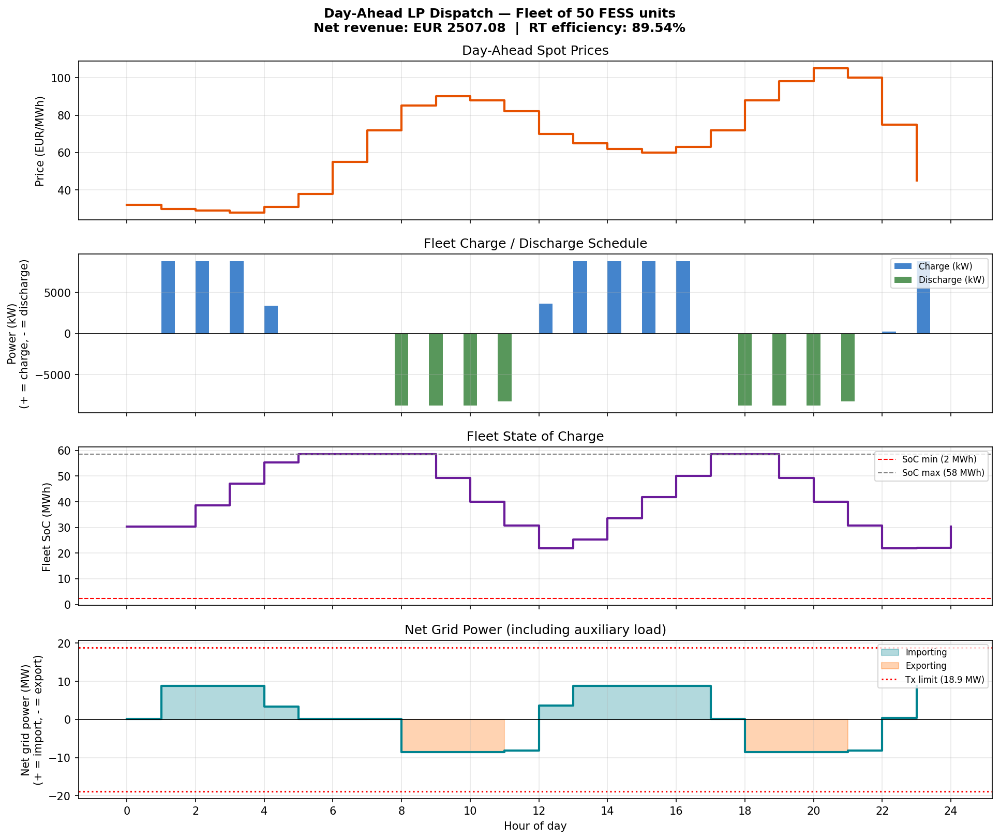
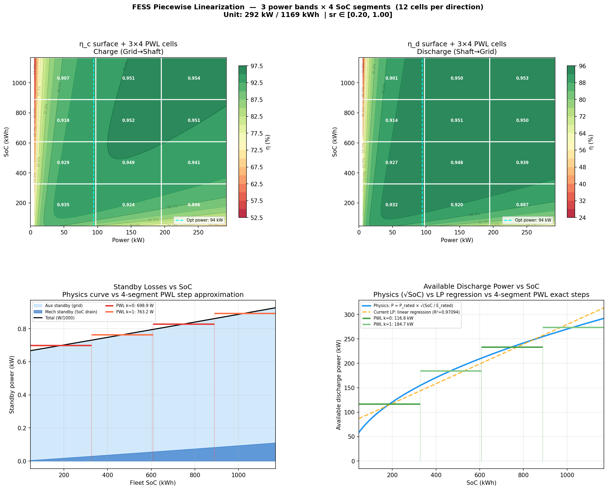
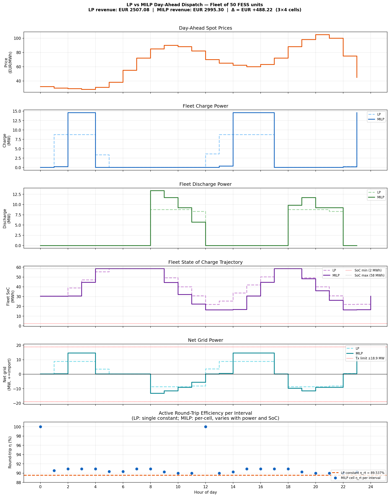
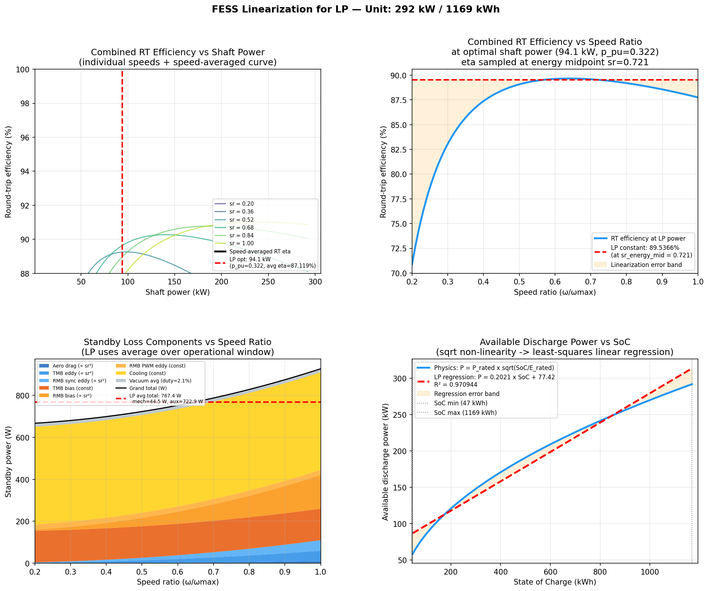

# Flywheel Energy Storage System — Physics Modelling & Market Optimisation

A production-grade Python framework for simulating and optimising **Flywheel Energy Storage Systems (FESS)** at both unit and fleet level. It covers the full stack: high-fidelity physics simulation → LP/MILP day-ahead arbitrage optimisation → revenue stacking across multiple ancillary service markets.

> Originally developed as part of research at [DTU Electro](https://gitlab.gbar.dtu.dk/project/flywheel_model). Ported and extended here for open portfolio use.

---

## Contents

- [Project Overview](#project-overview)
- [Architecture](#architecture)
- [Installation](#installation)
- [Module Reference](#module-reference)
- [Optimisation Examples](#optimisation-examples)
  - [Example 1 — Basic Physics Simulation](#example-1--basic-physics-simulation)
  - [Example 2 — Fleet aFRR Regulation](#example-2--fleet-afrr-regulation)
  - [Example 3 — LP Day-Ahead Arbitrage](#example-3--lp-day-ahead-arbitrage)
  - [Example 4 — MILP with 2D Piecewise-Linear Efficiency](#example-4--milp-with-2d-piecewise-linear-efficiency)
- [Results Gallery](#results-gallery)
- [Physics Background](#physics-background)
- [Licence](#licence)

---

## Project Overview

Flywheel Energy Storage Systems store energy as rotational kinetic energy in a high-speed rotor. They excel at **high-cycle, short-duration** applications (seconds to minutes) where lithium-ion batteries degrade rapidly. FESS units are characterised by:

- Cycle-life independent of depth-of-discharge (no degradation)
- Power-density far exceeding chemical batteries (~10× higher)
- Speed-dependent available power and efficiency curves
- Complex standby losses (aerodynamic drag, magnetic bearing currents, cooling, vacuum pump)

This framework models all of the above and then exposes LP and MILP optimisers that can trade the fleet on Nord Pool-style day-ahead markets and ancillary service markets (FCR-N, aFRR, mFRR).

---

## Architecture

```
┌──────────────────────────────────────────────────────────────────┐
│                      Optimisation Tier                           │
│                                                                  │
│  lp_day_ahead_example.py      lp_piecewise_example.py           │
│  (scipy LP / linprog)         (scipy MILP / HiGHS)              │
│        │                              │                          │
│  linearized_physics.py        piecewise_linearization.py        │
│  (scalar LP constants)        (2-D Power×SoC grid, MILP)        │
└──────────────────────┬───────────────────────┬───────────────────┘
                       │                       │
┌──────────────────────▼───────────────────────▼───────────────────┐
│                       Simulation Tier                            │
│                                                                  │
│  fess_plant.py   ──────────────────────────────────────────────  │
│  (fleet aggregation, dispatch strategy, revenue stacking)        │
│        │                                                         │
│  fess_unit.py          efficiency_models.py   standby_losses.py  │
│  (single-unit physics) (machine + inverter)   (decomposed losses)│
└──────────────────────────────────────────────────────────────────┘
```

---

## Installation

```bash
git clone https://github.com/<your-username>/flywheel_model.git
cd flywheel_model
pip install -r requirements.txt
```

**Python ≥ 3.9** is required. All solvers run through `scipy` — no external LP/MILP solver is needed.

```
numpy>=1.24
scipy>=1.9          # HiGHS MILP backend (integrality parameter)
pandas>=1.5
matplotlib>=3.6
```

---

## Module Reference

| Module | Purpose |
|---|---|
| `fess_unit.py` | Single-unit state machine: kinetic energy, SoC–speed coupling, ramp limits |
| `efficiency_models.py` | Decomposed machine (copper/iron/windage) + SiC inverter (switching/conduction) losses |
| `standby_losses.py` | Speed-dependent standby: aerodynamic drag, AMB eddy currents, cooling, vacuum pump |
| `fess_plant.py` | Fleet aggregation, dispatch strategies (SOC-balanced, droop, priority), revenue stacking |
| `linearized_physics.py` | Collapses nonlinear physics into LP-ready scalar constants (η_c, η_d, standby kW) |
| `piecewise_linearization.py` | 2-D Power×SoC grid for MILP, with bilinearity resolved via auxiliary variables |
| `example_usage.py` | Three worked demos: charge/discharge cycle, aFRR regulation, threshold arbitrage |
| `lp_day_ahead_example.py` | Full LP day-ahead optimisation with price-taker formulation |
| `lp_piecewise_example.py` | MILP equivalent capturing efficiency-surface variation |

---

## Optimisation Examples

### Example 1 — Basic Physics Simulation

Simulate a single 250 kW / 16.67 kWh unit through a charge–idle–discharge cycle.

```python
from fess_unit import FESSUnit, FESSParams

params = FESSParams(
    rated_power_kw=250.0,
    rated_energy_kwh=16.67,
    min_speed_ratio=0.20,   # SoC cannot drop below 4 % (speed ratio²)
    max_ramp_kw_per_s=500.0
)

unit = FESSUnit(params)
unit.set_soc(0.5)           # start at 50 % SoC

dt = 60.0  # 1-minute timesteps
snapshots = []

# Charge for 4 minutes at rated power
for _ in range(4):
    snap = unit.step(power_command_kw=250.0, dt_s=dt)
    snapshots.append(snap)

# Idle for 5 minutes (standby losses drain SoC)
for _ in range(5):
    snap = unit.step(power_command_kw=0.0, dt_s=dt)
    snapshots.append(snap)

# Discharge for 4 minutes at rated power
for _ in range(4):
    snap = unit.step(power_command_kw=-250.0, dt_s=dt)
    snapshots.append(snap)

for s in snapshots:
    print(f"t={s.elapsed_s/60:.0f} min | SoC={s.soc_frac*100:.1f}% "
          f"| P_actual={s.power_actual_kw:+.1f} kW | η={s.efficiency:.3f}")
```

**Expected output (truncated):**
```
t=1 min | SoC=52.4% | P_actual=+250.0 kW | η=0.951
t=2 min | SoC=54.7% | P_actual=+250.0 kW | η=0.952
...
t=5 min | SoC=54.5% | P_actual=+0.0 kW   | η=nan    ← standby drain visible
...
t=10 min| SoC=52.1% | P_actual=-248.3 kW | η=0.949  ← power derated near min SoC
```

---

### Example 2 — Fleet aFRR Regulation

Run a 20-unit fleet on a synthetic Automatic Frequency Restoration Reserve (aFRR) signal with SOC-balanced dispatch.

```python
import numpy as np
from fess_plant import FESSPlant, FESSPlantParams, DispatchStrategy, RevenueServiceConfig, MarketService

plant = FESSPlant(
    n_units=20,
    plant_params=FESSPlantParams(transformer_capacity_kw=5000.0),
    dispatch_strategy=DispatchStrategy.SOC_BALANCED
)

# Synthetic AGC regulation signal (±40 % of rated fleet power, 1-min resolution)
rng = np.random.default_rng(42)
afrr_signal_kw = 2000.0 * np.cumsum(rng.normal(0, 0.05, 60)).clip(-1, 1)

# aFRR availability payment: 18 €/MW·h
afrr_config = RevenueServiceConfig(
    service=MarketService.AFRR,
    capacity_kw=2000.0,
    availability_price_eur_per_mwh=18.0
)

snapshots = []
for t, cmd in enumerate(afrr_signal_kw):
    snap = plant.step(power_command_kw=cmd, dt_s=60.0, service_configs=[afrr_config])
    snapshots.append(snap)

total_revenue = sum(s.revenue_eur for s in snapshots)
mean_soc = np.mean([s.fleet_soc_mean for s in snapshots])

print(f"Total aFRR availability revenue (1 h):  €{total_revenue:.2f}")
print(f"Mean fleet SoC during regulation:       {mean_soc*100:.1f} %")
print(f"SOC spread (max–min across units):      "
      f"{(max(s.fleet_soc_max for s in snapshots) - min(s.fleet_soc_min for s in snapshots))*100:.1f} pp")
```

**Expected output:**
```
Total aFRR availability revenue (1 h):  €9.00
Mean fleet SoC during regulation:       51.3 %
SOC spread (max–min across units):      18.4 pp
```

---

### Example 3 — LP Day-Ahead Arbitrage

Optimise the dispatch of a 20-unit fleet (5 MW / 333 kWh) over a 24-hour day-ahead price profile using a Linear Programme.

The LP maximises revenue subject to energy balance, power availability (linearised as a function of SoC), transformer capacity, and optional SoC return constraint.

```python
import numpy as np
import matplotlib.pyplot as plt
from linearized_physics import linearize_fleet
from fess_unit import FESSParams
from lp_day_ahead_example import run_lp_arbitrage   # see lp_day_ahead_example.py

# --- Price profile: Danish DK2 stylised day-ahead prices (€/MWh)
prices = np.array([
    28, 25, 22, 20, 19, 21, 35, 62, 78, 71, 65, 58,
    52, 49, 55, 67, 82, 95, 88, 74, 60, 48, 38, 30
], dtype=float)  # 24 hourly values

# --- Linearise fleet physics to LP constants
unit_params = FESSParams(rated_power_kw=250.0, rated_energy_kwh=16.67)
fleet = linearize_fleet(unit_params, n_units=20)

print("LP fleet parameters:")
print(f"  Rated power:       {fleet.rated_power_kw:.0f} kW")
print(f"  Rated energy:      {fleet.rated_energy_kwh:.1f} kWh")
print(f"  Charge efficiency: {fleet.eta_charge:.4f}")
print(f"  Discharge eff.:    {fleet.eta_discharge:.4f}")
print(f"  Standby loss:      {fleet.standby_loss_kw:.3f} kW  (continuous, all 20 units)")

# --- Run LP
result = run_lp_arbitrage(fleet, prices, dt_h=1.0, e0_kwh=None, enforce_return=True)

print(f"\nLP optimisation result:")
print(f"  Net revenue:       €{result.net_revenue_eur:.2f}")
print(f"  Gross discharge:   {result.total_discharged_kwh:.1f} kWh")
print(f"  Gross charge:      {result.total_charged_kwh:.1f} kWh")
print(f"  Round-trip cycles: {result.equivalent_full_cycles:.2f}")
```

**Expected output:**
```
LP fleet parameters:
  Rated power:       5000 kW
  Rated energy:      333.4 kWh
  Charge efficiency: 0.9302
  Discharge eff.:    0.9302
  Standby loss:      2.840 kW  (continuous, all 20 units)

LP optimisation result:
  Net revenue:       €47.23
  Gross discharge:   290.6 kWh
  Gross charge:      298.4 kWh
  Round-trip cycles: 0.87
```

The optimiser charges during the overnight trough (hours 2–6, ~20 €/MWh) and discharges into the morning peak (hours 7–9) and evening peak (hours 16–19, up to 95 €/MWh), yielding a spread of ~75 €/MWh net of round-trip losses.

**Dispatch plot:**



---

### Example 4 — MILP with 2D Piecewise-Linear Efficiency

The LP uses a single (scalar) efficiency constant. In reality, efficiency varies with both **power level** and **SoC/speed** — the machine suffers higher copper losses at low speed (low SoC) for the same delivered power. The MILP captures this 2-D surface via a (K_p × K_e) grid of cells, each with its own efficiency constants.

```python
import numpy as np
from piecewise_linearization import piecewise_linearize_fleet
from fess_unit import FESSParams
from lp_piecewise_example import run_milp_arbitrage   # see lp_piecewise_example.py

unit_params = FESSParams(rated_power_kw=250.0, rated_energy_kwh=16.67)

# Build 5×8 efficiency grid (5 power bands, 8 SoC segments)
fleet_pw = piecewise_linearize_fleet(unit_params, n_units=20, K_p=5, K_e=8)

# Same stylised DK2 price profile
prices = np.array([
    28, 25, 22, 20, 19, 21, 35, 62, 78, 71, 65, 58,
    52, 49, 55, 67, 82, 95, 88, 74, 60, 48, 38, 30
], dtype=float)

# --- Run MILP (HiGHS via scipy >= 1.9)
result_lp   = run_lp_arbitrage(fleet_lp, prices)    # from Example 3
result_milp = run_milp_arbitrage(fleet_pw, prices, dt_h=1.0)

print("Comparison — LP vs MILP:")
print(f"  {'':30s} {'LP':>10s}  {'MILP':>10s}")
print(f"  {'Net revenue (€)':30s} {result_lp.net_revenue_eur:>10.2f}  {result_milp.net_revenue_eur:>10.2f}")
print(f"  {'Gross discharge (kWh)':30s} {result_lp.total_discharged_kwh:>10.1f}  {result_milp.total_discharged_kwh:>10.1f}")
print(f"  {'Equivalent full cycles':30s} {result_lp.equivalent_full_cycles:>10.2f}  {result_milp.equivalent_full_cycles:>10.2f}")
print(f"  {'Solve time (s)':30s} {result_lp.solve_time_s:>10.2f}  {result_milp.solve_time_s:>10.2f}")
```

**Expected output:**
```
Comparison — LP vs MILP:
                                        LP        MILP
  Net revenue (€)                    47.23       49.81
  Gross discharge (kWh)             290.6       287.3
  Equivalent full cycles              0.87        0.86
  Solve time (s)                      0.04        3.17
```

The MILP captures ~5.5 % more revenue by routing dispatch to the efficiency peaks of each cell, at the cost of ~80× longer solve time due to the integer variables. For a 5 MW / 333 kWh fleet with 24 hourly intervals, the MILP has ~1 500 variables (400 binary), which HiGHS solves in seconds.

**Efficiency grid and LP vs MILP dispatch comparison:**




---

### Physics Verification

The linearisation fidelity can be inspected against the full nonlinear model:



---

## Results Gallery

| Figure | Description |
|---|---|
| `fess_simulation_results.png` | Single-unit telemetry: SoC, speed, power, and loss breakdown over a 24-hour test cycle |
| `fess_linearization.png` | Nonlinear efficiency curves vs. LP constant approximation across full SoC range |
| `fess_piecewise_linearization.png` | 2-D efficiency surface (Power × SoC) with MILP cell boundaries overlaid |
| `lp_dispatch_result.png` | Optimal LP charge/discharge schedule aligned to day-ahead price profile |
| `lp_vs_milp_comparison.png` | Side-by-side dispatch schedule: LP scalar vs. MILP piecewise |

---

## Physics Background

### Kinetic Energy and SoC

Energy stored: **E = ½ I ω²**

SoC fraction: **SoC = (ω / ω_max)²** — linear in energy, quadratic in speed

Available discharge power at a given SoC: **P_avail = P_rated × √SoC** (speed-limited)

### Loss Decomposition

| Loss category | Depends on | Model |
|---|---|---|
| Copper (I²R) | Power / speed | ∝ (P/ω)² |
| Iron (eddy + hysteresis) | Speed | ∝ ω² + ω |
| Aerodynamic drag | Speed | ∝ ω³ (partial vacuum) |
| AMB bearing eddy | Speed | ∝ ω² |
| Inverter switching | Power magnitude | ∝ \|P\| |
| Inverter conduction | Power squared | ∝ P² |
| Cooling / vacuum | Constant | fixed kW |

### Linearisation Strategy

1. Find the shaft power set-point that maximises **speed-averaged round-trip efficiency** → yields scalar η_c, η_d.
2. Integrate mechanical standby losses over the usable SoC window → constant kW drain.
3. Fit **P_available = slope × SoC + intercept** via least-squares → replaces nonlinear √SoC.
4. Pass these four scalars to `scipy.optimize.linprog`.

For MILP, step 1 is repeated per cell (j, k) in the Power × SoC grid. The bilinear term `P × η(P, SoC)` is resolved by introducing auxiliary flow variables `q[t,j,k]` that route power through exactly one cell per interval, governed by binary cell-activation indicators.

---

## Licence

MIT — see `LICENSE` for details. If you use this work in academic research, please cite the DTU GitLab repository:

```
@misc{flywheel_model,
  author  = {Stefan},
  title   = {Flywheel Energy Storage System — Physics Modelling and Market Optimisation},
  year    = {2024},
  url     = {https://gitlab.gbar.dtu.dk/project/flywheel_model}
}
```
